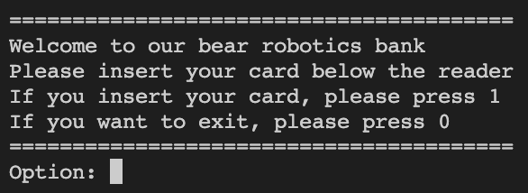

# Simple ATM controller

## Table of Contents

-   [About](#about)
-   [Usage](#usage)
-   [MISC.](#misc)

## About 

This is for the Bear Robotics coding test project. The project is a simple ATM controller that can be used to withdraw money from an ATM. It is written in C++ and runs on a CLI. The project is built using CMake and can be compiled on Windows, Linux, and Mac OS.

### Prerequisites

You only need a C++ compiler to build the project. The project uses only the standard C++ library and **does not rely on any third-party libraries.**

## Usage 

|pin number|balance|
|:---:|:---:|
|1234|1000|
|1234|3000|
|1234|4000|

I created a temporary bank system, as shown in the image above, in the [src/atm.cpp](src/atm.cpp) file.

|  |  |  |  |
| :---------------------------: | :---------------------------: | :---------------------------: | :---------------------------: |
|            Step 1             |            Step 2             |            Step 3             |            Step 4             |

You just follow the instruction on the screen like above.

## MISC.

-   I created some functions for future development, but I did not utilize them in this project.
-   Once the project is running, it will never stop on its own. This is because ATMs are not shut down but instead return to the main menu. Therefore, you need to manually close the program.
